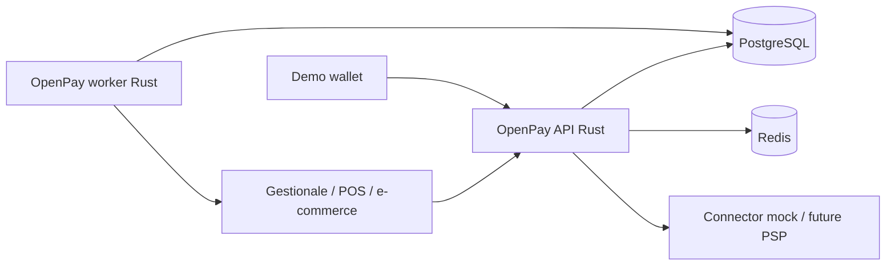

# Architecture

OpenPay Protocol is a non-custodial orchestration layer. Settlement always happens on an external rail (mock in v1).

## C4 context

## Containers

- `openpay-server`: Axum `/v1` merchant, admin, public QR APIs
- `openpay-worker`: outbox drain, webhook delivery, retries, SSRF guard
- `dashboard` / `demo-merchant` / `demo-wallet`: TypeScript UIs
- PostgreSQL: source of truth
- Redis: rate-limit / cache (optional degradation if down in dev)

## Modules

| Crate | Responsibility |
|---|---|
| `openpay-domain` | Entities, newtypes, state machine |
| `openpay-application` | Use cases, routing, QR verify, ports |
| `openpay-persistence` | SQLx, transactions, outbox |
| `openpay-connectors` | `PaymentConnector` trait + registry |
| `openpay-crypto` | HMAC, Argon2id, webhook signatures |
| `openpay-api` | HTTP adapters, JWT/API keys, OpenAPI |
| `openpay-worker` | Async delivery |

## Sync vs async

Creating a payment is synchronous and transactional (row + idempotency + audit + outbox). Merchant webhooks are asynchronous: the worker publishes outbox records into `webhook_deliveries` and retries with jitter.

## Multi-tenancy

Every payment, attempt, webhook, and audit row is scoped by `tenant_id`. API keys and JWTs carry tenant identity; queries include it.

## Connector pattern

Business logic never imports a PSP SDK. It calls `PaymentConnector`. v1 ships `mock-instant`, `manual-test`, and a feature-gated open-banking stub that **does not** connect to a bank.

Routing may retry a **bounded** list of next enabled connectors from the policy (`max_attempts`, allowed failure codes such as `TIMEOUT`). It does not pick a “cheapest rail”.

Sandbox mock/manual attempt state is stored in PostgreSQL (`sandbox_connector_attempts`) so the API server and worker share decisions after restart. Connector `configuration_ref` values that look like `secret://` are wrapped with `ENCRYPTION_MASTER_KEY` as `enc:v1:` (AES-256-GCM), not a KMS.
